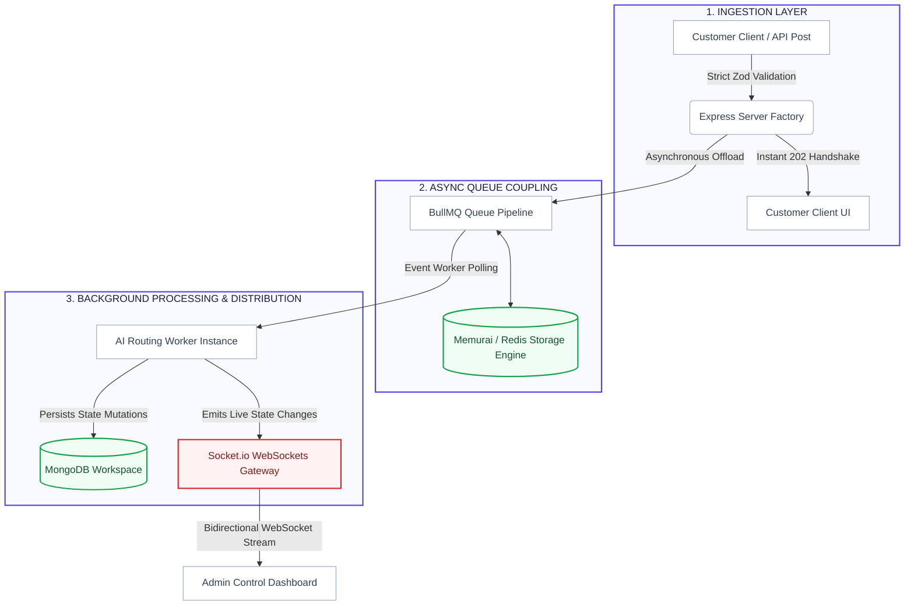

# AI Request Router 

An asynchronous, real-time customer ticket ingestion and automatic classification routing engine.

##  Key Features
- **Asynchronous Data Ingestion:** Uses an Express server structure to accept raw ticket payloads instantly via a `202 Accepted` response pattern, avoiding request blocking.
- **Background Task Processing:** Powered by **BullMQ** and **Redis (Memurai)** to handle high-throughput ticket classification asynchronously via worker scripts.
- **Automated AI Routing Layer:** Evaluates raw text content to intelligently classify ticket `Category` and critical `Priority` queues.
- **Real-Time Live Dashboard:** Built using React and synchronized via **Socket.io** web sockets to update live dashboard state profiles seamlessly without manual page reloads.
- **Data Integrity & Audit Trails:** Backed by MongoDB schemas featuring automated tracking milestones from `New` to `Processing` and `Completed` operations.
- **Robust Automated Tests:** Comprehensive system verification using **Vitest** and **Supertest** covering 13 individual validation, authentication, and routing test conditions.

##  Tech Stack
- **Frontend:** React, TailwindCSS, Socket.io-client
- **Backend:** Node.js, Express, Socket.io, BullMQ
- **Database:** MongoDB (Mongoose ODM), Redis (Memurai)
- **Testing:** Vitest, Supertest

##  Architectural Overview

The system is engineered with a strict separation of concerns to scale independently across distinct service layers:

1. **Ingestion Gateway:** An Express.js REST API validates incoming customer payloads using structural `Zod` schemas and emits an immediate `202 Accepted` handshake response back to the sender along with an isolated tracking transaction ID.
2. **Asynchronous Queue Coupling:** Ingested ticket payloads are seamlessly pushed into a robust **BullMQ** processing queue managed by an in-memory **Redis (Memurai)** data structure instance. This instantly frees up the HTTP server layer to intercept subsequent requests.
3. **AI Classification Engine Worker:** An independent background worker service continuously polls the Redis instance, pops fresh queue messages, abstracts them through our processing routers, and intelligently tags the ticket with calculated **Category** and **Priority** classifications.
4. **Real-Time Data Distribution:** Once worker mutation is finished, the backend updates the database state layer and instantly broadcasts a secure real-time notification to the administration workspace client via a **Socket.io (WebSockets)** gateway.
5. **Admin Control Dashboard:** A highly interactive React interface that updates state profiles, notification counters, and filter blocks dynamically with zero manual page refreshes.

---
##   System Architecture Diagram

| Layer | System Component | Communication Protocol | Target Dependency |
| :--- | :--- | :--- | :--- |
| **1. Ingestion** | Customer Client / API Post | `HTTP POST` (Zod Checked) | Express API Backend |
| **2. Response** | Express Server Factory | `JSON (Status 202)` | Customer UI (Instant Return) |
| **3. Queueing** | Asynchronous Offload Pipeline | `BullMQ Native Driver` | Memurai / Redis Engine |
| **4. Processing**| Decoupled Background Worker | `Event Polling Loop` | AI Routing Classifiers |
| **5. Persistence**| State Mutation Tracking | `Mongoose ODM` | MongoDB Workspace |
| **6. Real-Time** | Dynamic State Broadcast | `WebSockets (WS)` | Admin Dashboard Interface |




##  API Documentation

### Authentication Endpoints

#### `POST /api/v1/auth/register`
Creates a new administrative or agent user account within the system.

- **Request Body (JSON):**
  ```json
  {
    "email": "admin@example.com",
    "password": "password123",
    "role": "admin"
  }
  ```
- **Success Response (201 Created):**
  ```json
  {
    "success": true,
    "message": "User registered successfully.",
    "data": {
      "user": {
        "id": "6668a2bf72e11d0449911aaa",
        "email": "admin@example.com",
        "role": "admin"
      },
      "token": "eyJhbGciOiJIUzI1NiIsInR5cCI6IkpXVCJ9..."
    }
  }
  ```
  #### `POST /api/v1/auth/login`
  - **Request Body (JSON):**
  ```json
  {
  "email": "admin@example.com",
  "password": "password123"
  }
  ```
  - **Success Response (200 OK):**
  ```json
      {
  "success": true,
  "message": "Authentication successful.",
  "data": {
    "user": {
      "id": "6668a2bf72e11d0449911aaa",
      "email": "admin@example.com",
      "role": "admin"
    },
    "token": "eyJhbGciOiJIUzI1NiIsInR5cCI6IkpXVCJ9..."
  }
  }
  ```

  ### Customer Requests Endpoints
  #### `POST /api/v1/requests`
  
  - **Request Body (JSON):**
  ```json
  {
  "title": "Database connection timeout error",
  "originalMessage": "Getting intermittent 504 errors on production when pulling user analytics records.",
  "customerEmail": "devops@clientcorp.com",
  "sourceChannel": "api"
  }
  ```
  - **Success Response (202 Accepted):**
  ```json
  {
  "success": true,
  "message": "Customer request successfully received and queued for classification.",
  "data": {
    "ticketId": "6668a2bf72e11d0449911abc",
    "jobQueued": true
  }
  }
  ```
   - **Error Response (422 Unprocessable Entity - Bad Input):**
  ```json
  {
  "success": false,
  "error": "Validation Error",
  "details": ["sourceChannel: Invalid enum value. Expected 'email' | 'chat' | 'phone' | 'portal' | 'api'"]
  }
  ```
  #### `GET /api/v1/requests`
   - **Headers:** Authorization: Bearer <JWT_TOKEN>
   - **Query Parameters (Optional):** status (Enum: New, Processing, Completed)
   - priority (Enum: Low, Medium, High, Critical)
   - category (Enum: Technical, Billing, Complaint, etc.)
   - page (Default: 1)
   - limit (Default: 10)

  - **Success Response (200 OK):**
  ```json
  {
  "success": true,
  "data": {
    "requests": [
      {
        "_id": "6668a2bf72e11d0449911abc",
        "title": "Database connection timeout error",
        "customerEmail": "devops@clientcorp.com",
        "sourceChannel": "api",
        "category": "Technical",
        "priority": "High",
        "status": "Processing",
        "createdAt": "2026-06-12T03:49:25.000Z"
      }
    ],
    "pagination": {
      "total": 1,
      "page": 1,
      "pages": 1,
      "limit": 10
    }
  }
  }
  ```
   - **Error Response (401 Unauthorized - Missing/Expired Token):**
  ```json
  {
  "success": false,
  "error": "Not authorized to access this resource."
  }
  ```
#### `PATCH /api/v1/requests/:id`
- **Headers:** Authorization: Bearer <JWT_TOKEN>
- **Request Body (JSON):**
  ```json
  {
  "status": "Completed"
  }
  ```
  - **Success Response (200 OK):**
  ```json
  {
  "success": true,
  "message": "Ticket status successfully updated.",
  "data": {
    "_id": "6668a2bf72e11d0449911abc",
    "status": "Completed",
    "auditLog": [
      {
        "status": "Processing",
        "updatedAt": "2026-06-12T03:50:00.000Z"
      },
      {
        "status": "Completed",
        "updatedAt": "2026-06-12T06:10:00.000Z"
      }
    ]
  }
  }
  ```
 # Local Setup & Configuration Guide
  ### 1. Environment Configurations Setup
  Create a .env file in your root workspace:
  ```
  PORT=5000
  MONGO_URI=sconnection string
  REDIS_URL=redis url
  JWT_SECRET=secret_key
  ```
 ### 2. Automated Workspace Database Seeding
  Populate your MongoDB indexes with real-world support tickets and logs before booting up the environment:
  ```bash
   node seed.mjs
  ```
### 3. Running Development Workers & Web Servers
  Open separate terminals for backend and frontend and run:
  ```bash
  npm run dev
```

# Isolated Integration Testing Suite Specification

##  Testing Architecture & Isolation Strategy

To ensure comprehensive system stability across CI/CD pipelines without creating active network footprints or requiring live external services, the testing suite utilizes **Vitest** and **Supertest** in a fully mocked sandbox environment. 

All primary external infrastructure boundaries are intercepted at module load-time using Vitest hoisting blocks (`vi.mock()`):
* **MongoDB (Mongoose):** Database document operations and state mutations are fully mocked to eliminate persistent data storage reads/writes.
* **BullMQ & Redis (Memurai):** Job enqueuing mechanisms are intercepted, allowing the API endpoints to instantly verify `202 Accepted` states without launching active processing loops.
* **Socket.io Gateway:** Live event emissions are tracked through spy listeners rather than spinning up open network ports.

---

##  Complete Test Execution Matrix (13 Passing Cases)

### 1. Authentication Integrity Pipeline (`tests/auth.test.js`)
Verifies endpoint access constraints, schema parsing via Zod, and data validation rules for administrative user lifecycles.

| Test Case Specification | Target Endpoint | Expected HTTP Status | Validation Scope |
| :--- | :--- | :--- | :--- |
| **Admin Registration** | `POST /api/v1/auth/register` | `201 Created` | Successfully parses data inputs, creates user schema row, and returns valid JWT token. |
| **Duplicate Prevention** | `POST /api/v1/auth/register` | `409 Conflict` | Identifies pre-existing e-mail keys in MongoDB and safely rejects registration. |
| **Registration Validation** | `POST /api/v1/auth/register` | `422 Unprocessable` | Catches malformed email structures or weak passwords using Zod schema guards. |
| **User Login** | `POST /api/v1/auth/login` | `200 OK` | Compares request credentials with security hashes and authorizes session with a new JWT. |
| **Invalid Password Guard** | `POST /api/v1/auth/login` | `401 Unauthorized` | Intercepts matching email records if the password hash validation routine fails. |
| **Unrecognized Account Guard** | `POST /api/v1/auth/login` | `401 Unauthorized` | Safely rejects login transactions if the email record is missing from the workspace database. |

### 2. Ingestion & Data Routing Pipeline (`tests/requests.test.js`)
Validates high-throughput public ingestion parameters and verifies that endpoint data access layers are strictly locked behind Role-Based Access Control (RBAC).

| Test Case Specification | Target Endpoint | Expected HTTP Status | Validation Scope |
| :--- | :--- | :--- | :--- |
| **Asynchronous Ingestion** | `POST /api/v1/requests` | `202 Accepted` | **Non-blocking stream validation.** Instantly logs request metadata, queues the job to BullMQ, and returns a ticket ID. |
| **Missing Parameter Guard** | `POST /api/v1/requests` | `422 Unprocessable` | Catches inputs with missing properties (e.g., empty `originalMessage` text strings). |
| **Invalid Channel Guard** | `POST /api/v1/requests` | `422 Unprocessable` | Confirms the request input matching `sourceChannel` belongs strictly to allowed enum variations. |
| **Route Lockdown (No Token)** | `GET /api/v1/requests` | `401 Unauthorized` | Blocks dashboard data access when requests do not present an `Authorization` header. |
| **Route Lockdown (Bad Token)** | `GET /api/v1/requests` | `401 Unauthorized` | Rejects administrative view configurations when an invalid, broken, or expired JWT string is supplied. |
| **Authorized Dashboard Fetch**| `GET /api/v1/requests` | `200 OK` | Successfully unlocks access when a valid Admin Bearer token passes validation filters. |
| **Real-time Lifecycle Mutation**| `PATCH /api/v1/requests/:id`| `200 OK` | Modifies ticket state, adds transactional timeline tracking data to the audit log, and signals Socket.io. |

---

##  Running the Test Suite Locally

To spin up the automated verification environment and execute the suite inside your terminal workspace, make sure your core dependencies are installed and run the testing runtime script:

```bash
# Execute full testing runner suite
npm test
```
---

# Application Screenshots

### Administrative Control Hub


### Dynamic Ticket Timeline & Audit Logs


---
# Technical Tradeoffs

##  Current Design vs. Future Production Scaling

### 1. Endpoint Security vs. Developer Velocity
* **What we have now:** The admin dashboard is fully secured using strong **JWT (JSON Web Tokens)** and Role-Based Access Control. However, the public ingestion endpoint (`POST /api/v1/requests`) is open to accept quick test inputs from any source.
* **The "Two More Weeks" Scale Plan:** In a real production environment, this public endpoint would be a target for spam or Denial of Service (DoS) attacks. We would implement **API Token Signature Verification**. Any external service sending a ticket (like a Shopify webhook or a mobile app) would have to sign the payload with a secret cryptographic key, ensuring our backend server only spends processing power on verified, authentic customer requests.

### 2. Rapid Database Prototyping vs. High-Volume Query Speed
* **What we have now:** MongoDB handles our data beautifully. It dynamically saves tickets, structures metadata, and appends chronological events into an internal `auditLog` history array. 
* **The "Two More Weeks" Scale Plan:** As the database grows to millions of support tickets, simple admin filters (like sorting by *Critical Priority* + *Processing Status*) will start to lag and slow down the dashboard. We would implement a formal **Compound Database Indexing Strategy** in MongoDB. By pre-indexing combinations of high-use query fields (e.g., `{ status: 1, priority: 1, createdAt: -1 }`), the database engine can find and sort matching rows instantly without scanning the entire database cluster.

### 3. Monolithic Execution vs. Horizontal Queue Scaling
* **What we have now:** The Express API server, the BullMQ message queue, and the background AI worker currently run together inside the same Node.js environment. This is perfect for local testing and low-volume environments.
* **The "Two More Weeks" Scale Plan:** If thousands of customers submit complex messages at the exact same second, the intensive computational work of classifying text via AI could starve the main Express server of CPU cycles, causing the live dashboard to freeze or disconnect. We would break the background worker out into its own **decoupled, horizontally scalable container (like a separate Docker service)**. This allows us to spin up 5 or 10 independent worker nodes to chew through massive queue spikes without adding a single millisecond of lag to the core admin dashboard interface.

## Demo video link :
https://drive.google.com/file/d/1jf699B7d09NWk-v16R3jJsDkn6NwqPQC/view?usp=drive_link
 
     
  
  

  
  
  
  


  
